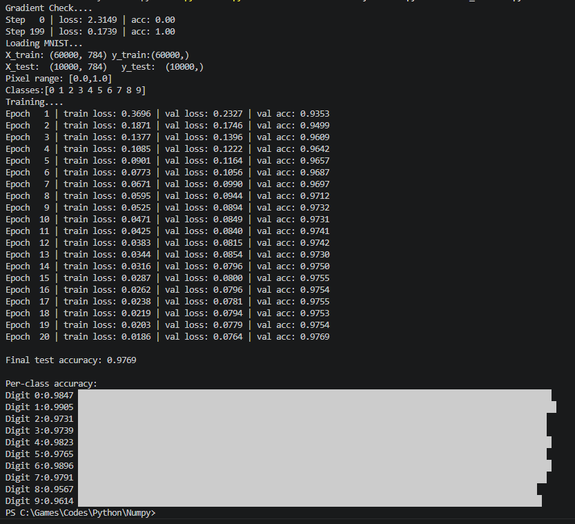

# NumPy Tutorial
 
> A structured, ground-up curriculum for mastering NumPy as a foundation for deep learning engineering — culminating in a neural network trained on MNIST using **zero deep learning frameworks**.

---

## Final Result

**97.69% test accuracy on MNIST — pure NumPy, no PyTorch, no TensorFlow.**

```
Input (784) → Linear → ReLU → Linear → Softmax → Output (10)
Architecture : 2-layer fully connected network
Optimiser    : SGD with Momentum (β=0.9)
Loss         : Cross-Entropy
Initialisation: Kaiming (He) Normal
Epochs       : 20  |  Batch size: 64  |  LR: 0.01
```



---

## Why This Exists

Most people learn PyTorch by copying tutorial code without understanding what happens underneath. This curriculum reverses that — every operation a deep learning framework performs is first implemented manually in NumPy, so when you move to PyTorch you are not guessing, you are recognising.

---

## Structure

```
NUMPY/
├── Core/          Week 1 — foundational NumPy
├── Power/         Week 2 — advanced NumPy for DL
└── Pro/           Week 3 — neural network from scratch
```

---

### Week 1 — Core NumPy

| File | Topic | Key Concepts |
|------|-------|-------------|
| `1_Basic.py` | Arrays, shapes, dtypes | ndarray, shape, dtype, arange, linspace |
| `2_Slice&Index.py` | Indexing & slicing | 2D indexing, boolean masking, fancy indexing |
| `3_Broadcasting.py` | Broadcasting | Shape compatibility rules, axis alignment |
| `4_Vectorization.py` | Vectorisation | No-loop operations, ufuncs, speed benchmarks |
| `5_AxisOps.py` | Axis operations | sum/mean/max along axes, keepdims, argmax |
| `6_Reshaping.py` | Reshaping | reshape, flatten, squeeze, expand_dims |
| `7_Stack&Split.py` | Stacking & splitting | concatenate, stack, split, Q/K/V split |

---

### Week 2 — Power NumPy

| File | Topic | Key Concepts |
|------|-------|-------------|
| `1_LinAlg.py` | Linear algebra | matmul, transpose, norm, SVD, eigendecomposition |
| `2_Einsum.py` | Einstein summation | dot products, batched matmul, attention scores |
| `3_Rand&Reps.py` | Random & reproducibility | Seeds, distributions, Xavier/Kaiming initialisation |
| `4_AdvMask_Indexing.py` | Advanced masking | Padding masks, causal masks, gather, scatter |
| `5_Performance.py` | Performance | Views vs copies, memory layout, contiguity, profiling |

---

### Week 3 — Neural Network from Scratch

| File | Description |
|------|-------------|
| `neural_network.py` | Complete implementation — every function from scratch |
| `results.png` | Training curve and final accuracy |

**Everything implemented manually:**

```python
relu(x)                        # activation
relu_backward(grad_out, x)     # gradient of ReLU
softmax(x)                     # numerically stable
cross_entropy_loss(probs, y)   # negative log likelihood
cross_entropy_backward(probs, y)  # combined softmax+CE gradient
linear_forward(x, W, b)        # single linear layer
linear_backward(grad_out, x, W)   # gradients for x, W, b
kaiming_init(fan_in, fan_out)  # He normal initialisation
init_network(layer_sizes)      # full network initialisation
forward(X, params)             # forward pass with cache
backward(probs, y, cache, params)  # full backpropagation
gradient_check(params, X, y)   # numerical gradient verification
sgd_momentum(params, grads, v) # optimiser
train(...)                     # complete training loop
```

---

## Gradient Verification

All gradients verified against numerical approximation — errors below `1e-5`:

```
Gradient check (should be < 1e-5):
  W1: max error = 1.62e-08  ✓
  b1: max error = 8.03e-09  ✓
  W2: max error = 1.33e-08  ✓
  b2: max error = 2.12e-08  ✓
```

---

## Training Curve

```
Epoch  1 | train loss: 0.3696 | val loss: 0.2327 | val acc: 0.9353
Epoch  2 | train loss: 0.1871 | val loss: 0.1746 | val acc: 0.9499
Epoch  5 | train loss: 0.0901 | val loss: 0.1164 | val acc: 0.9657
Epoch 10 | train loss: 0.0471 | val loss: 0.0849 | val acc: 0.9731
Epoch 15 | train loss: 0.0287 | val loss: 0.0800 | val acc: 0.9755
Epoch 20 | train loss: 0.0186 | val loss: 0.0764 | val acc: 0.9769
```

---

## Per-Class Accuracy

```
Digit 0:  98.47%  ████████████████████
Digit 1:  99.05%  ████████████████████
Digit 2:  97.31%  ███████████████████▌
Digit 3:  97.39%  ███████████████████▌
Digit 4:  98.23%  ███████████████████▉
Digit 5:  97.65%  ███████████████████▌
Digit 6:  98.96%  ███████████████████▉
Digit 7:  97.91%  ███████████████████▋
Digit 8:  95.67%  ███████████████████▏
Digit 9:  96.14%  ███████████████████▎
```

---

## How to Run

```bash
# Install dependencies
pip install numpy scikit-learn

# Run the neural network
python Pro/neural_network.py
```

MNIST downloads automatically on first run via scikit-learn (~12MB).

---

- **Vanishing/exploding gradients** are visible — wrong init causes std to collapse or explode across layers within 5 forward passes
- **Kaiming initialisation** keeps activation std stable (~0.8) across 10 layers with ReLU
- **The softmax+cross-entropy gradient** simplifies to `probs - one_hot(labels)` — one of the most elegant results in DL math
- **In-place NumPy operations** (`-=`) corrupt cached values during backprop — a silent bug that frameworks prevent automatically
- **Gradient checking** is non-negotiable — analytical and numerical gradients must match to `1e-5` before trusting any custom backward pass

---
